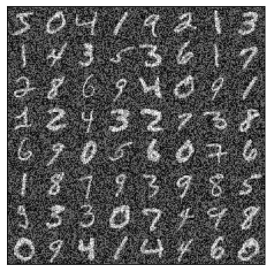

<h1 align='center'> Expectation Maximisation Flows </h1>

Implementation of the paper ['Learning Diffusion Priors from Observations by Expectation Maximization' (Rozet++24)](https://arxiv.org/abs/2405.13712) in PyTorch. 

To implement:
- [ ] Mixed precision,
- [ ] EMA,
- [ ] Hyperparameter/model saving,
- [ ] Data-parallelism,
- [ ] PPCA for $q_0(x)$, denoiser module for $q_0(x)$.

#### Usage

To install

```
pip install emflows 
```

To test a flow-matching model on MNIST or CIFAR10.

```
uv run python fm.py
```

To run expectation maximisation for the equivalent architecture and latent variables (only MNIST for now)

```
uv run python em.py
```

#### Samples

<p align="center">
  <picture>
    
  </picture>
</p>

<p align="center">
  <picture>
    
  </picture>
</p>


#### Citation

```bibtex
@misc{rozet2024learningdiffusionpriorsobservations,
      title={Learning Diffusion Priors from Observations by Expectation Maximization}, 
      author={François Rozet and Gérôme Andry and François Lanusse and Gilles Louppe},
      year={2024},
      eprint={2405.13712},
      archivePrefix={arXiv},
      primaryClass={cs.LG},
      url={https://arxiv.org/abs/2405.13712}, 
}
```